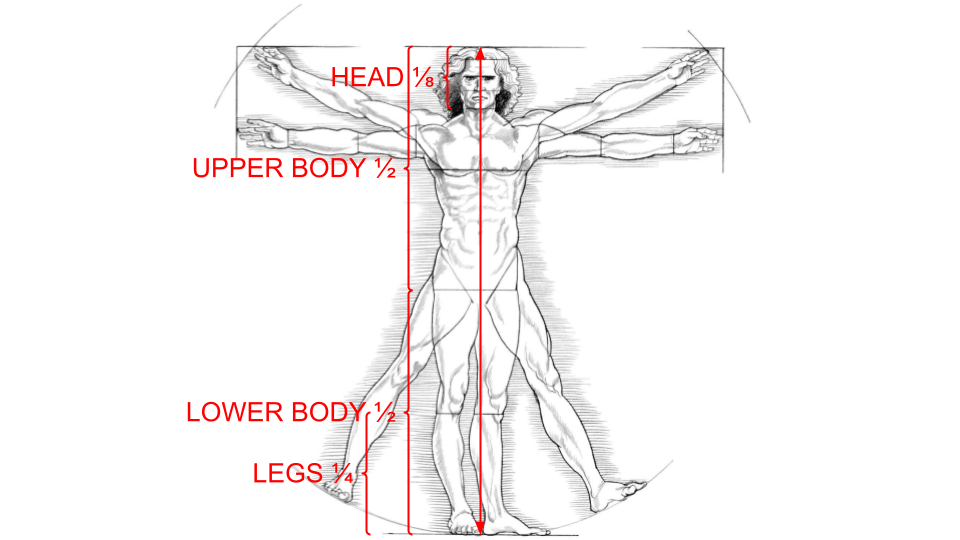
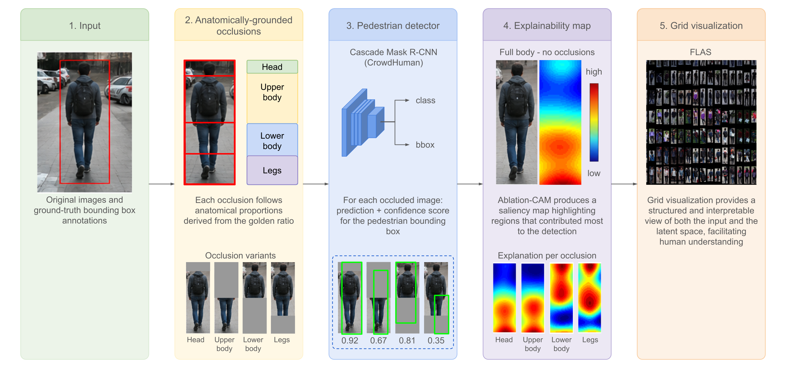
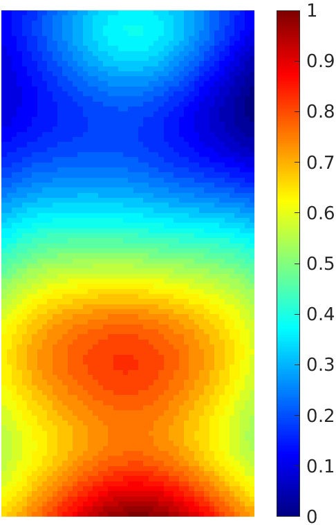
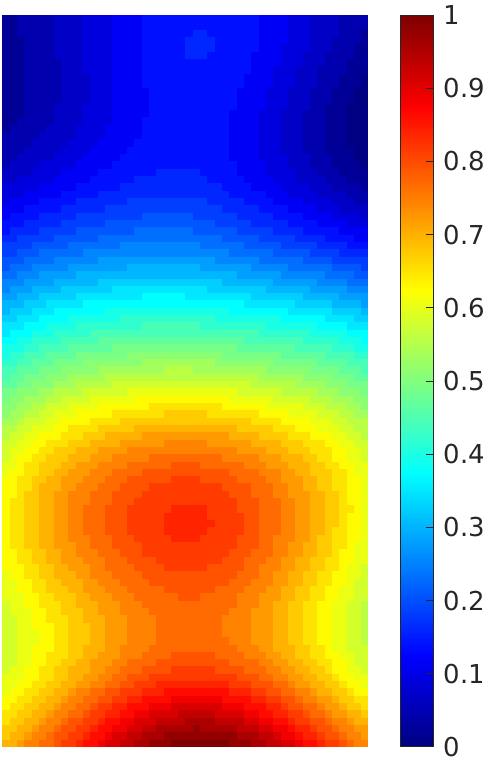
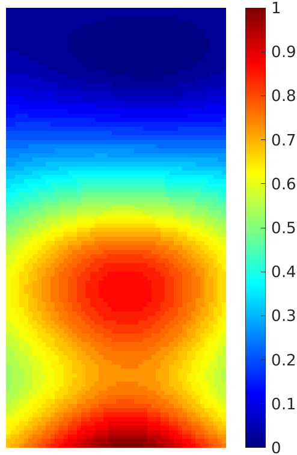
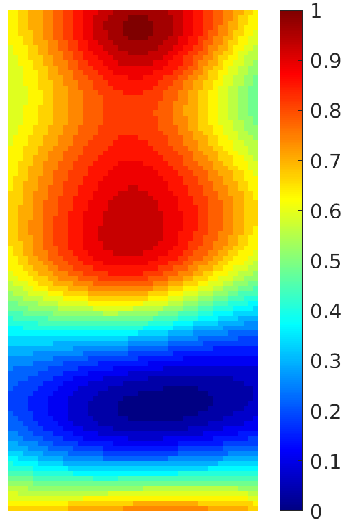
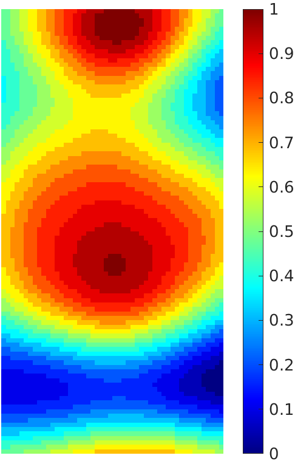

# Semantically Grounded Explainability for Pedestrian Detection Using Anatomically Grounded Occlusions and Grid-Based Visualization

Official implementation accompanying the paper:

> **Semantically Grounded Explainability for Pedestrian Detection Using Anatomically Grounded Occlusions and Grid-Based Visualization**  
> **Chiara Galdi** and **Romain Giot**  
> *IEEE International Conference on Content-Based Multimedia Indexing (CBMI), ExFMA Special Session, 2026*

---

## Introduction

Explainable Artificial Intelligence (XAI) aims to understand how and why machine learning models make their decisions. While popular explainability techniques such as Class Activation Maps (CAMs) identify image regions contributing to a prediction, they often provide limited semantic insight into **why** these regions are important from a human perspective.

This repository accompanies our CBMI 2026 paper, which introduces a semantically grounded explainability framework for pedestrian detection. The proposed approach combines:

- **Local explainability**, obtained through anatomically grounded occlusions and Ablation-CAM;
- **Global explainability**, obtained through FLAS and t-SNE grid visualizations of pedestrian representations.

Instead of relying on arbitrary perturbations, body regions are defined using anatomically meaningful proportions inspired by Leonardo da Vinci's *Vitruvian Man*, enabling a more intuitive interpretation of detector behavior.

Our experiments reveal an important observation: although the detector attention is primarily concentrated on the **leg region**, the largest degradation in detection performance occurs when the **upper body** is occluded. This suggests that pedestrian detectors rely on complementary semantic body cues beyond the most visually salient regions.

This repository contains all scripts required to reproduce the experiments presented in the paper, including:

- pedestrian detection using Pedestron,
- Ablation-CAM explainability,
- anatomically grounded occlusion experiments,
- detection performance evaluation,
- average CAM visualization,
- generation of the figures reported in the paper.

Interactive high-resolution FLAS and t-SNE visualizations (including CAM-thresholded representations) are available at:

**https://galdi.eurecom.io/ExFMA2026_supplementary_material.html**

---

# Repository Structure

This repository is a lightweight research release built on two existing projects:

- **Pedestron**
  https://github.com/hasanirtiza/Pedestron

- **MMDetection**
  https://github.com/open-mmlab/mmdetection

Only the scripts and dependencies required to reproduce the experiments of the paper are included.

```
.
├── configs/
├── mmdet/
├── pdestre_experiments/
├── extract_pdestre_frames.py
├── generate_ablation_cam.py
├── generate_ablation_cam_occluded.py
├── evaluate_detection_ap.py
├── summarize_cam_heatmaps.py
├── INSTALL.md
├── EXPERIMENTS.md
└── README.md
```

### Main scripts

| Script | Description |
|--------|-------------|
| `extract_pdestre_frames.py` | Extract annotated frames from P-DESTRE videos |
| `generate_ablation_cam.py` | Generate Ablation-CAM explanations |
| `generate_ablation_cam_occluded.py` | Generate explanations under anatomical occlusions |
| `evaluate_detection_ap.py` | Evaluate pedestrian detection performance |
| `summarize_cam_heatmaps.py` | Compute average Ablation-CAM heatmaps |

---

# Installation

## 1. Clone the repository

```bash
git clone https://github.com/YOUR_USERNAME/YOUR_REPOSITORY.git
cd YOUR_REPOSITORY
```

---

## 2. Create the environment

```bash
conda create -n pedestron-exp python=3.7 -y
conda activate pedestron-exp

conda install cython
```

Install the PyTorch version corresponding to your CUDA installation:

https://pytorch.org

Install the repository

```bash
pip install -v -e .
```

See **INSTALL.md** for complete installation instructions.

---

## 3. Install explainability dependencies

```bash
pip install opencv-python scipy pillow
```

Install a Pedestron-compatible version of **pytorch-grad-cam** supporting:

- AblationLayerPedestron
- pedestron_ablation_reshape_transform
- FasterRCNNBoxScoreTarget

---

## 4. Prepare the P-DESTRE dataset

Download the P-DESTRE dataset separately.

Expected folder structure:

```
data/P_Destre/

    annotation/
    videos/
    frames/
```

Generate the `frames/` directory using the extraction script described below.

Download (or train) a detector checkpoint compatible with

```
configs/elephant/p_destre/cascade_hrnet.py
```

---

# Reproducing the Experiments

The experimental pipeline consists of five stages.

---

## Step 1 — Extract frames

```bash
python extract_pdestre_frames.py \
  --annotation-dir data/P_Destre/annotation \
  --video-dir data/P_Destre/videos \
  --output-dir data/P_Destre/frames
```

---

## Step 2 — Generate baseline Ablation-CAM

```bash
python generate_ablation_cam.py \
  configs/elephant/p_destre/cascade_hrnet.py \
  checkpoint.pth \
  data/P_Destre/frames \
  outputs/visible_PDestre_out
```

---

## Step 3 — Anatomical occlusion experiments

Run once for each occlusion region:

- head
- top
- bottom
- legs

Example:

```bash
python generate_ablation_cam_occluded.py \
  configs/elephant/p_destre/cascade_hrnet.py \
  checkpoint.pth \
  data/P_Destre/frames \
  outputs/visible_PDestre_head_exp_out \
  --gt-annotation-dir data/P_Destre/annotation \
  --occlusion-region head
```

---

## Step 4 — Detection evaluation

```bash
python evaluate_detection_ap.py \
  --detection-dir outputs/visible_PDestre_head_exp_out \
  --annotation-dir data/P_Destre/annotation
```

---

## Step 5 — Average CAM heatmaps

```bash
python summarize_cam_heatmaps.py \
  --cam-dir outputs/visible_PDestre_head_exp_out \
  --annotation-dir data/P_Destre/annotation \
  --output-image outputs/mean_map_head_out.png
```

---

# Results

## Detection performance

| Occlusion | AP | Recall | Precision | F1 |
|-----------|----|---------|-----------|----|
| Full body (original) | 85.68 | 57.94 | 88.79 | 0.701 |
| Full body (¼ size) | 86.51 | 57.38 | 90.28 | 0.701 |
| Lower body | 68.37 | 49.74 | 80.52 | 0.615 |
| Upper body | **35.25** | 30.22 | 59.96 | 0.401 |
| Head | 81.98 | 55.09 | 87.45 | 0.674 |
| Legs | 79.83 | 54.53 | 86.26 | 0.668 |

The largest degradation occurs when the **upper body** is occluded, despite Ablation-CAM indicating the strongest attention on the **leg region**, highlighting the difference between visual saliency and semantic importance.

---

## Anatomically grounded occlusions

<p align="center">

</p>

Body regions are partitioned into:

- Head (top 1/8)
- Upper body (top half)
- Lower body (bottom half)
- Legs (bottom quarter)

These anatomically meaningful regions are used to generate the occlusion experiments.

---

## Experimental pipeline

<p align="center">

</p>

The framework combines:

1. Anatomically grounded occlusions
2. Pedestrian detection
3. Ablation-CAM local explainability
4. FLAS / t-SNE global explainability

---

## Average Ablation-CAM heatmaps

Average heatmaps are computed by

- cropping pedestrians using ground-truth bounding boxes,
- discarding bounding boxes with aspect ratio < 0.6,
- resizing each crop to 50×100 pixels,
- averaging all normalized CAMs.

<p align="center">

</p>

Occlusion experiments:

| Head | Upper body | Lower body | Legs |
|:----:|:----------:|:----------:|:----:|
|  |  |  |  |

Under upper-body occlusion, the detector shifts attention toward the remaining lower-body structures. Conversely, when the lower body is occluded, attention redistributes toward the head and torso.

---

# Supplementary Material

Interactive high-resolution visualizations are available at

https://galdi.eurecom.io/ExFMA2026_supplementary_material.html

---

# Further Reading

- `INSTALL.md`
- `EXPERIMENTS.md`
- Pedestron
- MMDetection

---

# Citation

If you use this repository, please cite:

```bibtex
@inproceedings{Galdi2026ExFMA,
  author    = {Chiara Galdi and Romain Giot},
  title     = {Semantically Grounded Explainability for Pedestrian Detection Using Anatomically Grounded Occlusions and Grid-Based Visualization},
  booktitle = {IEEE International Conference on Content-Based Multimedia Indexing (CBMI)},
  year      = {2026}
}
```

---

# License

The original code and scripts developed for this work are released under the **MIT License** (see the accompanying `LICENSE` file).

This repository builds upon the following third-party projects:

- **Pedestron**: https://github.com/hasanirtiza/Pedestron
- **MMDetection**: https://github.com/open-mmlab/mmdetection

These projects are distributed under their own respective licenses. Users are responsible for reviewing and complying with the licensing terms of Pedestron, MMDetection, and any other third-party dependencies before using, modifying, or redistributing this repository.
